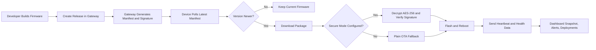

# SentinelOTA: Secure OTA Update Security Mechanism

SentinelOTA (OTA_IOT) is a full-stack secure OTA firmware update platform for heterogeneous IoT devices.

The platform combines:

- Firmware-side update logic
- Gateway release and telemetry services
- Web dashboard control plane
- Security-focused update verification

Target device families:

- ESP32
- ESP8266
- ATmega328P
- STM32F103

## 1. Problem Faced and Problem Solved

### Problems faced in OTA projects

- Multi-board firmware delivery is hard to standardize.
- Tampered and rollback firmware are major security risks.
- Teams often need both serial flashing and network OTA in one system.
- Runtime telemetry, releases, and deployments are usually fragmented.
- Production-grade orchestration can be expensive.

### How SentinelOTA solves them

- Unified dashboard for auth, serial upload, runtime snapshot, and deployment actions.
- Secure package verification with encryption + signature checks.
- Anti-rollback version comparison in firmware.
- ASH health score with quarantine behavior for risky devices.
- API key-protected gateway writes and token-authenticated dashboard APIs.
- Local-first architecture that works without mandatory paid cloud infrastructure.

## 2. Workflow Overview



## 3. Tech Stack

| Layer | Technology |
| --- | --- |
| Control Plane | Next.js 16, React 19, TypeScript |
| UI | Tailwind CSS, Radix UI, Lucide, Recharts |
| Local Auth/Data | Node crypto, NeDB (nedb-promises) |
| Serial Engine | arduino-cli via child process |
| Gateway | FastAPI, Uvicorn, Pydantic |
| Gateway Signing | Ed25519 (cryptography) |
| Firmware Runtime | Arduino framework (ESP32 family) |
| Firmware Security | AES-256-CBC + RSA verification (mbedTLS) |
| OTA Protocols | ArduinoOTA push + manifest pull OTA |
| Automation | GitHub workflow for release builds |

## 4. Dependencies and Requirements

### Core prerequisites

- Node.js 20+
- pnpm
- Python 3.10+
- PlatformIO (recommended) or Arduino IDE 2.x
- arduino-cli (required for OTA IDE serial upload API)

### Dependency manifests

- OTA IDE: CODE/OTA_IDE/package.json
- Gateway: src/implementation/requirements.txt
- Firmware toolchain config: CODE/frimware_code/platformio.ini

## 5. Project Structure

```text
OTA_IOT/
|- CODE/
|  |- OTA_IDE/                  # Main Next.js secure OTA dashboard
|  |- frimware_code/            # Firmware and OTA build/deploy config
|  `- docs/ota-ide/             # OTA IDE architecture/dev docs
|- src/
|  |- implementation/           # FastAPI gateway, simulator, smoke tests
|  `- server/                   # Prototype server snippets
|- OTA_UI/                      # Additional UI workspace
|- firmware_repo/               # Firmware metadata cache/artifacts
|- gateway_firmware_cache/      # Gateway manifest/cache state
|- gateway_keys/                # Gateway signing key material
|- docs/                        # Guides, reports, research, patents, references
`- README.md
```

Note: folder name frimware_code is currently used as-is in this repository.

## 6. Configuration

### OTA IDE environment

Reference file:

- CODE/OTA_IDE/.env.example

Key variables:

- HOSTNAME, PORT
- OTA_ADMIN_USERNAME, OTA_ADMIN_PASSWORD, OTA_SESSION_TTL_HOURS
- OTA_LOCAL_DB_DIR
- EDGE_GATEWAY_URL, EDGE_GATEWAY_API_KEY
- OTA_RUNTIME_COMMANDS_ENABLED
- OTA_RUNTIME_COMMAND_TOKEN
- OTA_RUNTIME_COMMAND_ALLOWLIST
- OTA_RUNTIME_COMMAND_CWD
- ARDUINO_CLI_PATH
- OTA_FQBN_ESP32, OTA_FQBN_ESP8266, OTA_FQBN_ATMEGA328P, OTA_FQBN_STM32F103

### Gateway environment

Defined in src/implementation/edge_gateway.py:

- OTA_GATEWAY_HOST, OTA_GATEWAY_PORT
- OTA_GATEWAY_CACHE_DIR, OTA_GATEWAY_KEYS_DIR
- OTA_GATEWAY_API_KEY
- OTA_GATEWAY_PUBLIC_URL
- OTA_GATEWAY_SIGNING_KEY_ID
- OTA_GATEWAY_RELEASE_ARTIFACT
- OTA_MAX_DEVICE_LOG_ENTRIES, OTA_MAX_EVENTS, OTA_MAX_ALERTS, OTA_MAX_RELEASES
- OTA_DEFAULT_COMPATIBILITY

### Firmware configuration

Configured in:

- CODE/frimware_code/ota_config.h
- CODE/frimware_code/esp32_ota_main/ota_config.h

Main firmware macros:

- WIFI_SSID, WIFI_PASSWORD
- OTA_PASSWORD, DEVICE_HOSTNAME
- BACKEND_URL, BACKEND_API_KEY
- DEVICE_ID, DEVICE_TYPE
- FIRMWARE_ENC_KEY, FIRMWARE_PUB_KEY

Security rule:

- Never commit real credentials or private keys.

## 7. API Management

### OTA IDE internal API routes

| Route | Method | Auth | Purpose |
| --- | --- | --- | --- |
| /api/auth/login | POST | No | Create session token |
| /api/auth/logout | POST | Yes | Revoke current token |
| /api/auth/session | GET | Yes | Validate session |
| /api/serial-ports | GET | Yes | Detect host serial ports |
| /api/serial/upload | POST | Yes | Start serial upload job |
| /api/serial/upload/[jobId] | GET | Yes | Poll upload state/logs |
| /api/runtime/snapshot | GET | Yes | Gateway snapshot aggregation |
| /api/runtime/command | POST | Session or service token | Controlled command execution |

### Edge gateway API routes

| Route | Method | API Key Needed | Purpose |
| --- | --- | --- | --- |
| /healthz | GET | No | Health probe |
| /api/heartbeat | POST | No | Device telemetry ingest |
| /api/dashboard | GET | Optional | Full runtime data payload |
| /api/releases | GET | No | List releases |
| /api/releases | POST | Yes | Create release + manifest + pipeline |
| /api/releases/latest | GET | No | Latest release and manifest |
| /api/deployments | GET | No | List deployments |
| /api/deployments | POST | Yes | Create deployment |
| /api/pipeline/run | POST | Yes | Re-run pipeline simulation |
| /api/trigger_sync | POST | Yes | Manual sync request |
| /releases/latest/manifest | GET | No | OTA manifest endpoint |
| /releases/latest/public-key | GET | No | Public key endpoint |
| /releases/download/{filename} | GET | No | Firmware binary download |

## 8. Middleware and Security Controls

### Middleware-like API wrapper

The OTA IDE uses withSecureApi to centralize request handling for Next.js APIs.

It provides:

- Local DB initialization
- Bootstrap admin validation/creation
- Optional route authentication
- API request logging (route, method, status, latency)

### Authentication and session security

- Password hashing with scrypt
- Token hashing with sha256
- Session expiration and revocation tracking
- Rejection of default/demo bootstrap credentials

### Runtime command protection

- Explicit command allowlist
- Blocklist for destructive command patterns
- Blocked shell control characters and substitutions
- Disabled by default in production unless explicitly enabled

## 9. Algorithms Used

### 9.1 Anti-rollback version algorithm

Firmware maps semantic version to integer score:

$$
version_n = major \times 10000 + minor \times 100 + patch
$$

If incoming version score is less than current, update is blocked.

### 9.2 ASH score and quarantine algorithm

Health score update model:

$$
health_{t+1} = \text{clamp}(health_t + \Delta, 0, 100)
$$

Policy rules:

- If score < 40, device enters quarantine mode.
- Quarantine disables ArduinoOTA update handling.
- Quarantine is lifted when score returns to 100.

### 9.3 Secure OTA verification algorithm

Secure package flow in firmware:

1. Download package from gateway URL.
2. Read package header: 16-byte IV + 256-byte signature.
3. AES-256-CBC decrypt encrypted payload blocks.
4. Validate PKCS7 padding on final block.
5. Compute SHA-256 on decrypted firmware payload.
6. Verify RSA signature with embedded public key.
7. Flash only on successful verification.

Fallback behavior:

- If secure mode is not configured or secure flow fails, plain OTA flow is attempted.

### 9.4 Serial upload job algorithm

Upload job lifecycle:

- queued -> compiling -> uploading -> success or failed

Progress is inferred from CLI output patterns and persisted with rolling logs.

## 10. How Components Connect in Program

End-to-end connection path:

1. Device sends heartbeat to gateway at /api/heartbeat.
2. Gateway updates device registry, events, alerts, and state cache.
3. OTA IDE calls /api/runtime/snapshot.
4. Snapshot API fetches gateway /api/dashboard and /releases/latest/manifest.
5. Frontend renders devices, releases, events, pipeline, keys, and deployments.
6. Gateway release creation writes firmware artifact + signed manifest.
7. Firmware polls manifest, applies anti-rollback, then updates if eligible.
8. Post-update heartbeats feed back into monitoring and ASH scoring.

Closed loop:

observe -> decide -> deploy -> verify -> observe

## 11. How to Execute and Run

### Step 1: Clone repository

```bash
git clone https://github.com/Rithik-sharma12/Secure_OTA_Update_Security_Mechanism.git
cd Secure_OTA_Update_Security_Mechanism
```

### Step 2: Start gateway backend

```powershell
Set-Location src/implementation
py -m venv .venv
.\.venv\Scripts\Activate.ps1
pip install -r requirements.txt
uvicorn edge_gateway:app --host 0.0.0.0 --port 5000
```

### Step 3: Start OTA IDE

```powershell
Set-Location CODE/OTA_IDE
pnpm install
pnpm dev
```

Open <http://localhost:3000> in browser.

### Step 4: Configure OTA IDE environment

1. Copy CODE/OTA_IDE/.env.example to CODE/OTA_IDE/.env.local.
2. Set strong OTA_ADMIN_USERNAME and OTA_ADMIN_PASSWORD.
3. Set EDGE_GATEWAY_URL.
4. Set EDGE_GATEWAY_API_KEY if gateway write APIs are protected.

### Step 5: Build and flash firmware over USB (first flash)

```powershell
Set-Location CODE/frimware_code
pio run -e esp32dev
pio run -e esp32dev --target upload
```

### Step 6: OTA network update

```powershell
$env:ESP32_OTA_HOST="<device-ip>"
$env:ESP32_OTA_PASSWORD="<ota-password>"
pio run -e esp32dev_ota --target upload
```

### Step 7: Optional simulation and smoke tests

```powershell
Set-Location src/implementation
python device_simulator.py ESP32
python integration_smoke_test.py
```

## 12. How to Use (Beginner Flow)

1. Open OTA IDE and login.
2. Check serial ports in Devices panel.
3. Upload firmware for first-time provisioning.
4. Create release in gateway (UI/API path).
5. Confirm manifest and release visibility.
6. Let device poll or trigger manual update.
7. Watch events, ASH score, and deployment status.
8. Use runtime snapshot for live operational state.

## 13. Extraordinary Features

- Dual update model: ArduinoOTA push + backend pull OTA.
- Secure OTA package processing with encryption and signature checks.
- Plain OTA fallback for operational continuity.
- Anti-rollback firmware version policy.
- Device health scoring with automatic quarantine behavior.
- Ed25519-signed release metadata and public key endpoint.
- Unified runtime snapshot with devices, releases, pipeline, keys, and deployments.
- Local authenticated API wrapper with structured audit logs.
- Serial upload queue with persisted logs and incremental polling.
- Runtime command endpoint protected by allowlist and command safety checks.

## 14. Troubleshooting

- Device not visible over OTA: confirm host and device share the same network and ArduinoOTA is active.

- Serial upload failure: verify COM port format (example COM3), board FQBN mapping, and arduino-cli path.

- Release creation failure: provide sourceFilePath or set OTA_GATEWAY_RELEASE_ARTIFACT.

- Unauthorized API response: validate OTA IDE bearer session and gateway API key alignment.

- Runtime command rejected: review OTA_RUNTIME_COMMAND_ALLOWLIST and runtime command enable policy.

## 15. Documentation Map

- docs/README.md
- CODE/README.md
- CODE/docs/ota-ide/OTA_IDE_ARCH.md
- CODE/docs/ota-ide/OTA_IDE_Details_Task.md
- CODE/docs/ota-ide/OTA_IDE_DEV.md
- CODE/docs/ota-ide/OTA_README.md
- CODE/frimware_code/SETUP_GUIDE.md
- src/implementation/README.txt

## 16. Git Sync Commands

### Pull latest

```bash
git pull origin main
```

### Commit and push

```bash
git add -A
git commit -m "your message"
git push origin main
```

### If push is rejected

```bash
git pull --rebase origin main
git push origin main
```

## 17. Docker Container Deployment

Secure_OTA can be containerized for college systems and deployed in two modes:

- Build locally from source with `docker compose`.
- Pull prebuilt images from Docker Hub and run with `docker compose -f docker-compose.hub.yml`.

### 17.1 Prepare environment file

```powershell
Copy-Item .env.docker.example .env.docker
```

Update at least:

- `OTA_ADMIN_PASSWORD`
- `OTA_GATEWAY_API_KEY`
- `DOCKERHUB_USER` (for Docker Hub pull mode)

If password contains `#`, keep it quoted.

### 17.2 Run from local source build

```powershell
docker compose --env-file .env.docker up -d --build
docker compose ps
```

### 17.3 Run by pulling from Docker Hub

```powershell
docker compose -f docker-compose.hub.yml --env-file .env.docker pull
docker compose -f docker-compose.hub.yml --env-file .env.docker up -d
docker compose -f docker-compose.hub.yml --env-file .env.docker ps
```

### 17.4 Publish images to Docker Hub

```powershell
docker login
docker build -t <dockerhub-user>/secure-ota-gateway:latest ./src/implementation
docker push <dockerhub-user>/secure-ota-gateway:latest
docker build -t <dockerhub-user>/secure-ota-ide:latest ./CODE/OTA_IDE
docker push <dockerhub-user>/secure-ota-ide:latest
```

### 17.5 Detailed guide

See `docs/guides/DOCKER_DEPLOYMENT.md` for full steps, update workflows, and operational notes.
