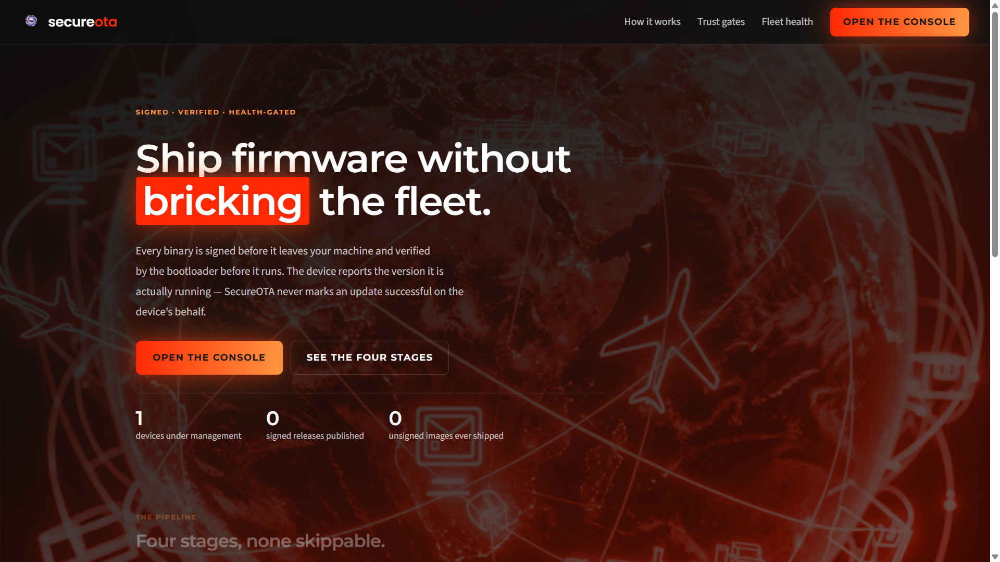
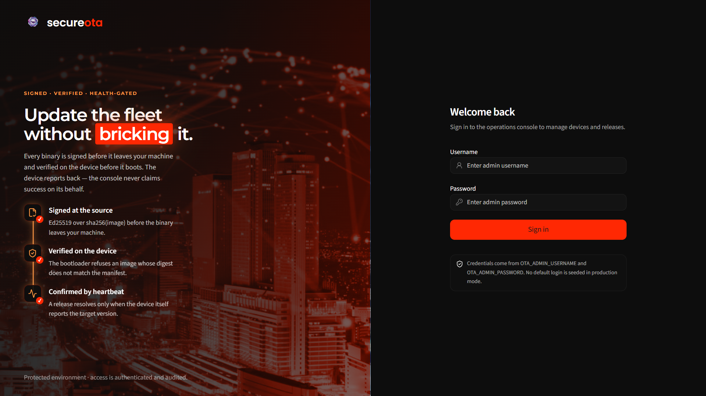
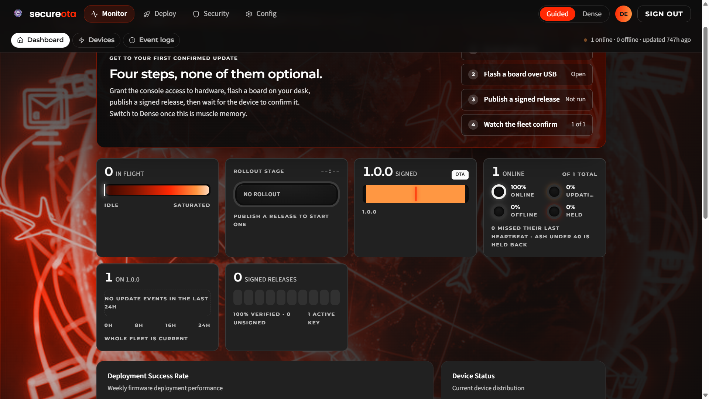
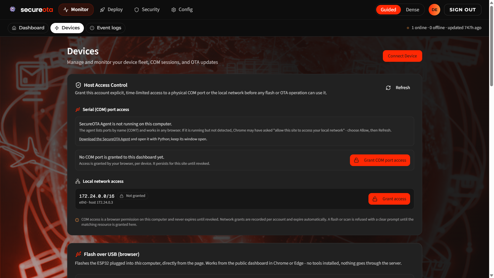
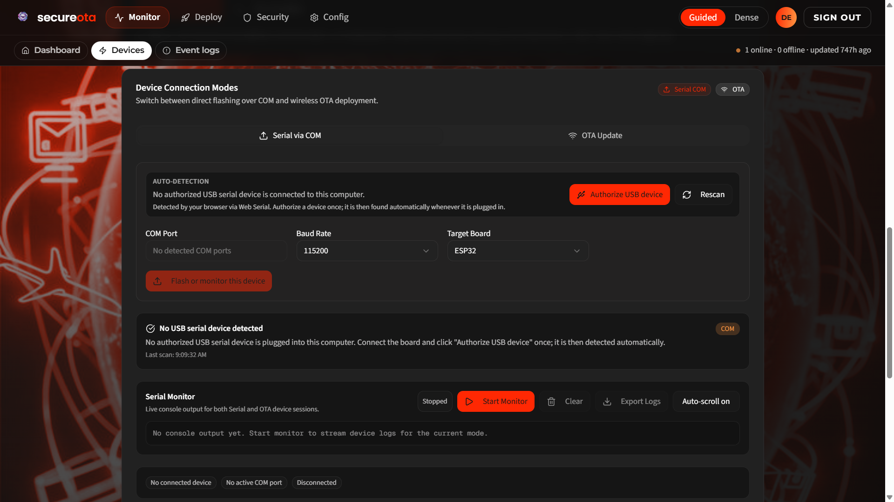
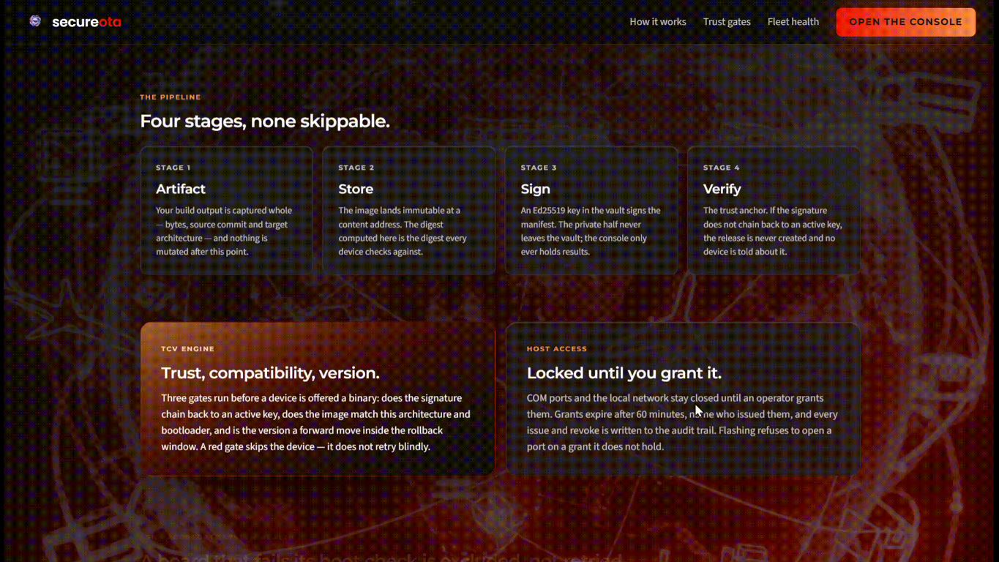
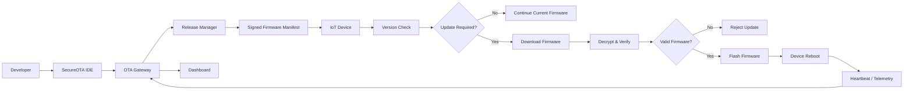
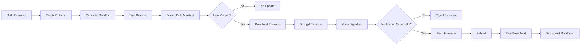

# SecureOTA — Secure OTA Update Mechanism for Resource-Constrained IoT Devices

<p align="center">
  
</p>

<p align="center">
  <strong>A secure, full-stack OTA firmware update platform for heterogeneous IoT devices.</strong>
</p>

<p align="center">
  Secure firmware delivery • Device monitoring • Release management • Security verification • Serial & OTA deployment
</p>

---

## Overview

**SecureOTA** is a full-stack secure Over-the-Air (OTA) firmware update platform designed for heterogeneous and resource-constrained IoT devices.

The platform provides a centralized environment for:

* 🔐 Secure firmware verification
* 📦 Firmware release management
* 📡 OTA firmware deployment
* 🔌 USB/Serial firmware flashing
* 📊 Device monitoring and telemetry
* 🛡️ Anti-rollback protection
* ❤️ Device health scoring
* 🚨 Automatic device quarantine
* 🔑 Cryptographic release signing
* 🧩 Multi-board firmware management

### Supported Device Families

The current PlatformIO firmware project targets:

* ESP32 DevKit
* ESP32-S3
* ESP32-C3

The OTA IDE also includes board profiles for ESP8266, ATmega328P, and
STM32F103 firmware workflows.

---

# Project Screenshots

### SecureOTA Dashboard

<p align="center">
  
</p>

### Device Monitoring

<p align="center">
  
</p>

### Release & Firmware Management

<p align="center">
  
</p>

### Deployment & OTA Operations

<p align="center">
  
</p>

### Security / Runtime Monitoring

<p align="center">
  
</p>

### Interface Walkthrough

The following recording shows the main SecureOTA interface and dashboard
workflow:

<p align="center">
  
</p>

---

# 1. Problem Statement

Traditional IoT firmware deployment becomes difficult when multiple device types, firmware versions, deployment methods, and security requirements need to be managed together.

Common problems include:

* Different firmware flashing methods for different boards
* Difficulty managing multiple firmware versions
* Risk of deploying tampered firmware
* Firmware downgrade and rollback attacks
* Lack of centralized device monitoring
* Fragmented serial and OTA deployment workflows
* Limited visibility into device health
* Lack of automated quarantine mechanisms
* Dependence on expensive cloud infrastructure

SecureOTA addresses these problems through a centralized OTA control platform.

---

# 2. Key Features

## 🔐 Secure Firmware Updates

SecureOTA supports cryptographic verification of firmware packages before flashing.

The secure update pipeline includes:

1. Firmware package download
2. Package header processing
3. AES-256-CBC decryption
4. PKCS7 padding validation
5. SHA-256 firmware hashing
6. RSA-2048 signature verification for encrypted device packages
7. Firmware flashing only after successful verification

Release manifests displayed by the gateway are signed separately with an
Ed25519 signing key. This keeps the manifest trust chain distinct from the
RSA-2048 package signature that is verified by the ESP32 firmware.

---

## 🛡️ Anti-Rollback Protection

SecureOTA prevents devices from installing older firmware versions.

Firmware versions are converted into a numerical representation:

```text
version_score = major × 10000 + minor × 100 + patch
```

If the incoming firmware version is lower than the currently installed version, the update is rejected.

Example:

```text
Current Version : 1.5.0
Incoming Version: 1.4.2

Result: UPDATE BLOCKED
```

---

## ❤️ Device Health & ASH Score

SecureOTA maintains a device health score between `0` and `100`.

```text
health(t+1) = clamp(health(t) + Δ, 0, 100)
```

When the health score becomes too low:

```text
Health Score < 40
        ↓
Device Quarantine
        ↓
OTA Update Handling Disabled
```

The device can leave quarantine once its health score reaches the configured recovery threshold.

---

## 📡 Dual OTA Architecture

SecureOTA supports two firmware update approaches:

### ArduinoOTA Push

The development system can directly push firmware to a device over the network.

### Manifest-Based OTA

The device communicates with the gateway, retrieves the latest firmware manifest, checks the version, downloads the firmware, verifies it, and performs the update.

```text
Developer
    │
    ▼
SecureOTA Gateway
    │
    ▼
Signed Firmware Manifest
    │
    ▼
IoT Device
    │
    ├── Version Check
    ├── Download Firmware
    ├── Decrypt
    ├── Verify Signature
    └── Flash Firmware
```

---

# 3. System Architecture


```mermaid
flowchart LR

    A[Developer] --> B[SecureOTA IDE]

    B --> C[OTA Gateway]

    C --> D[Release Manager]

    D --> E[Signed Firmware Manifest]

    E --> F[IoT Device]

    F --> G[Version Check]

    G --> H{Update Required?}

    H -- No --> I[Continue Current Firmware]

    H -- Yes --> J[Download Firmware]

    J --> K[Decrypt & Verify]

    K --> L{Valid Firmware?}

    L -- No --> M[Reject Update]

    L -- Yes --> N[Flash Firmware]

    N --> O[Device Reboot]

    O --> P[Heartbeat / Telemetry]

    P --> C

    C --> Q[Dashboard]
```

---

# 4. OTA Workflow


```mermaid
flowchart LR

    A[Build Firmware] --> B[Create Release]

    B --> C[Generate Manifest]

    C --> D[Sign Release]

    D --> E[Device Polls Manifest]

    E --> F{New Version?}

    F -- No --> G[No Update]

    F -- Yes --> H[Download Package]

    H --> I[Decrypt Package]

    I --> J[Verify Signature]

    J --> K{Verification Successful?}

    K -- No --> L[Reject Firmware]

    K -- Yes --> M[Flash Firmware]

    M --> N[Reboot]

    N --> O[Send Heartbeat]

    O --> P[Dashboard Monitoring]
```

---

# 5. Technology Stack

| Layer              | Technology                     |
| ------------------ | ------------------------------ |
| Dashboard          | Next.js 16.3, React 19.3      |
| Frontend Language  | TypeScript 5.9                 |
| Styling/UI         | Tailwind CSS, Radix UI        |
| Charts             | Recharts                       |
| Dashboard Storage  | NeDB / nedb-promises           |
| Gateway            | FastAPI + Uvicorn              |
| Gateway Language   | Python                         |
| Validation         | Pydantic                       |
| Manifest Signing   | Ed25519                        |
| Package Security   | AES-256-CBC + RSA-2048        |
| Firmware Hashing   | SHA-256                        |
| Firmware Tooling   | PlatformIO + Arduino framework |
| OTA Methods        | ArduinoOTA + manifest pull    |
| Containerization   | Docker Compose                 |

---

# 6. Project Structure

```text
Secure_OTA_Update_Security_Mechanism/
│
├── CODE/
│   ├── OTA_IDE/
│   │   ├── app/
│   │   ├── components/
│   │   ├── public/
│   │   ├── package.json
│   │   └── ...
│   │
│   ├── frimware_code/
│   │   ├── esp32_ota_main/
│   │   ├── ota_config.h
│   │   ├── platformio.ini
│   │   └── ...
│   │
│   └── docs/
│
├── src/
│   └── implementation/
│       ├── gateway/
│       │   ├── routes/
│       │   ├── crypto.py
│       │   ├── models.py
│       │   ├── release.py
│       │   ├── state.py
│       │   └── utils.py
│       │
│       ├── edge_gateway.py
│       ├── device_simulator.py
│       └── requirements.txt
│
├── firmware_repo/
├── gateway_firmware_cache/
├── gateway_keys/
├── docs/
├── pics/
│   ├── 1.1.png
│   ├── 1.png
│   ├── 2.png
│   ├── 3.png
│   └── 4.png
│
├── .env.example
├── docker-compose.yml
├── docker-compose.hub.yml
└── README.md
```

> **Note:** The firmware directory is currently named `frimware_code` in the repository.

---

# 7. Getting Started

## Run the gateway and dashboard locally

1. Copy `.env.example` to `.env` and set the required gateway API key and
   dashboard administrator credentials.
2. Install and start the FastAPI gateway:

   ```powershell
   cd src/implementation
   python -m venv .venv
   .\.venv\Scripts\Activate.ps1
   pip install -r requirements.txt
   uvicorn gateway:app --host 0.0.0.0 --port 5000
   ```

3. In a second terminal, install and start the dashboard:

   ```powershell
   cd CODE/OTA_IDE
   pnpm install
   pnpm dev
   ```

4. Open `http://localhost:3000`. The gateway health endpoint is available at
   `http://localhost:5000/healthz`.

## Run with Docker Compose

After configuring the environment values required by
[`docker-compose.yml`](docker-compose.yml), start both services with:

```powershell
docker compose up --build
```

The dashboard is exposed on port `3000` and the gateway on port `5000`.

## Build the firmware

From `CODE/frimware_code`, configure
`esp32_ota_main/ota_config.h` from the example file, then use PlatformIO:

```powershell
pio run -e esp32dev
pio run -e esp32dev -t upload
```

The firmware configuration supports local or cloud gateway URLs, authenticated
heartbeats, ArduinoOTA push updates, and optional encrypted package updates.

---

# 8. Security Architecture

SecureOTA implements multiple security controls throughout the update lifecycle.

### Authentication

* Session-based dashboard authentication
* Password hashing using `scrypt`
* Token hashing using `SHA-256`
* Session expiration
* Session revocation
* Strong administrator credentials

### API Security

* Gateway API key protection
* Authenticated dashboard APIs
* Protected firmware publishing endpoints
* Controlled runtime command execution
* API request logging

### Firmware Security

* AES-256-CBC encryption
* RSA signature verification
* SHA-256 hashing
* Anti-rollback version validation
* Firmware verification before flashing

### Runtime Security

* Command allowlisting
* Destructive command blocking
* Shell control character filtering
* Runtime command functionality disabled by default
* Device quarantine

---

# 9. Cryptographic Firmware Verification

The secure firmware package follows this process:

```text
Firmware
   │
   ▼
Encrypted Package
   │
   ├── 16-byte IV
   ├── 256-byte Signature
   └── Encrypted Firmware
          │
          ▼
     AES-256-CBC
          │
          ▼
    Decrypted Firmware
          │
          ▼
       SHA-256
          │
          ▼
    RSA Verification
          │
          ▼
    Valid Firmware?
       /        \
     NO          YES
     │            │
   Reject       Flash
```

Firmware is flashed only after successful verification.

---

# 10. API Endpoints

## OTA IDE APIs

| Endpoint                     | Method | Authentication | Purpose                   |
| ---------------------------- | ------ | -------------- | ------------------------- |
| `/api/auth/login`            | POST   | No             | Create session            |
| `/api/auth/logout`           | POST   | Yes            | Revoke session            |
| `/api/auth/session`          | GET    | Yes            | Validate session          |
| `/api/serial-ports`          | GET    | Yes            | Detect serial ports       |
| `/api/serial/upload`         | POST   | Yes            | Start firmware upload     |
| `/api/serial/upload/[jobId]` | GET    | Yes            | Monitor upload            |
| `/api/runtime/snapshot`      | GET    | Yes            | Retrieve runtime state    |
| `/api/runtime/command`       | POST   | Token/Session  | Execute approved commands |

## Gateway APIs

| Endpoint               | Method | Authentication | Purpose           |
| ---------------------- | ------ | -------------- | ----------------- |
| `/healthz`             | GET    | No             | Health check      |
| `/api/heartbeat`       | POST   | No             | Device telemetry  |
| `/api/dashboard`       | GET    | Optional       | Runtime dashboard |
| `/api/releases`        | GET    | No             | List releases     |
| `/api/releases`        | POST   | API Key        | Create release    |
| `/api/releases/latest` | GET    | No             | Latest release    |
| `/api/deployments`     | GET    | No             | List deployments  |
| `/api/deployments`     | POST   | API Key        | Create deployment |
| `/api/pipeline/run`    | POST   |                |                   |
