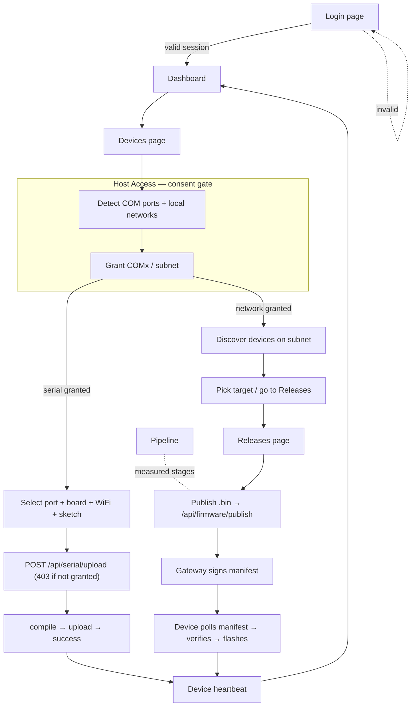

# SecureOTA — Frontend Design & UX Plan

A single reference for completing the dashboard frontend: the design system, the
screen-by-screen specs, the end-to-end flow from **login to code upload**, wireframes,
and the component/work inventory needed to finish it.

- **Stack:** Next.js 16 (App Router) · React 19 · Tailwind · shadcn/ui · lucide-react
- **App root:** `CODE/OTA_IDE/`
- **Audience:** whoever builds or reviews the dashboard UI
- **Status legend:** ✅ built · 🟡 partial/mock · 🔴 to build

---

## 1. Design principles

1. **The device is the source of truth.** The UI never claims a device updated; it
   reflects heartbeats. Every "success" is evidence-backed, never optimistic.
2. **Consent before capability.** A COM port or network is locked until granted. The UI
   makes the lock, the grant, and the expiry visible — never a silent capability.
3. **One primary action per screen.** Each screen has an obvious "do the thing" button;
   everything else is secondary or tertiary.
4. **Show state, not spinners-only.** Loading → skeletons; empty → guidance; error →
   cause + next step. Never a bare blank card.
5. **Same language everywhere.** Status tones (success/info/warning/error) map to the
   same colors and words on every screen.

---

## 2. Design system

### 2.1 Color tokens (already in the theme — use these, not raw hex)

| Token | Role |
|---|---|
| `--background` / `--foreground` | Page base + primary text |
| `--primary` / `--primary-foreground` | Primary actions (Flash, Publish, Sign in) |
| `--accent` | Brand accent, active nav, logo gradient stop |
| `--muted` / `--muted-foreground` | Secondary surfaces + secondary text |
| `--border` | Hairlines; use `border-border/50–60` for the glass look |
| `--card` / `--sidebar-*` | Card surface + sidebar palette |
| `--chart-1` | **success** (online, granted, verified) — green |
| `--chart-2` | **info** (neutral activity, OTA) — blue |
| `--chart-3` | **warning** (pending, degraded) — amber |
| `--chart-4` | **error** (offline, failed, revoked) — red |

**Status tone contract** (reuse verbatim):

```
success → bg-chart-1/20 text-chart-1     info → bg-chart-2/20 text-chart-2
warning → bg-chart-3/20 text-chart-3     error → bg-chart-4/20 text-chart-4
neutral → bg-muted text-muted-foreground
```

### 2.2 Surface & elevation

- Cards: `glass border-border/50` (frosted). Utilities already defined: `glass`,
  `glass-lg` (sidebar), `glass-sm` (footer strips).
- Nested panels inside a card: `rounded-lg border border-border/60 bg-muted/15 p-4`.
- Active accent glow on nav icons: `glow-accent`.

### 2.3 Typography & spacing

- Page title `text-3xl font-bold`; section title `CardTitle`; body `text-sm`; meta
  `text-xs text-foreground/60`.
- Vertical rhythm: page sections `space-y-6`; within a card `space-y-4/5`.
- Mono (`font-mono`) for ports, IPs, hashes, versions, log lines.

### 2.4 Iconography

lucide-react only, `h-4 w-4` inline / `h-5 w-5` headers. Canonical set: `Wifi` (OTA),
`Usb` (serial), `ShieldCheck` (security/consent), `Lock`/`Unlock` (grant state),
`Radar` (discovery), `GitBranch` (pipeline), `Code` (editor/releases), `Activity` (ASH).

### 2.5 Interaction states (every interactive element)

`default → hover → focus-visible (ring) → active → disabled → loading (Loader2 spin)`.
Destructive actions (revoke, delete, remove device) use `text-chart-4` and require a
confirm step.

---

## 3. Global layout (shell)

The authenticated app is one shell (`app/(dashboard)/layout.tsx`) that gates on session
and wraps every page. ✅ built.

```
┌───────────────┬─────────────────────────────────────────────────────┐
│  SIDEBAR      │  TOPBAR:  [☰]  Breadcrumb / title       [user ▾]      │
│  (collapsible)├─────────────────────────────────────────────────────┤
│  ┌─────────┐  │                                                       │
│  │OTA  IDE │  │   <PAGE CONTENT>                                      │
│  └─────────┘  │   p-3 → p-6, max readable width, space-y-6            │
│  Monitor      │                                                       │
│   Dashboard   │   ┌───────────────┐ ┌───────────────┐                 │
│   Devices     │   │  Card         │ │  Card         │                 │
│   Event Logs  │   └───────────────┘ └───────────────┘                 │
│  Deploy       │                                                       │
│   Pipeline    │                                                       │
│   Releases    │                                                       │
│   Manifest    │                                                       │
│   Code        │                                                       │
│  Security …   │                                                       │
│  Config …     │                                                       │
│  ● 3 Online   ├─────────────────────────────────────────────────────┤
│  ● 1 Offline  │  STATUSBAR: gateway reachable · version · UTC clock   │
└───────────────┴─────────────────────────────────────────────────────┘
```

- **Sidebar** ✅ — collapsible (`w-64 ↔ w-20`), mobile `Sheet`, live online/offline
  counts, section grouping.
- **TopBar** ✅ — mobile menu trigger; 🔴 add breadcrumb + user menu (profile, sign out,
  active-grants shortcut).
- **StatusBar** ✅ — gateway reachability + clock.

---

## 4. Information architecture (navigation map)

Matches `components/layout/Sidebar.tsx` today. Proposed additions marked 🔴.

| Group | Item | Route | Purpose | Status |
|---|---|---|---|---|
| Monitor | Dashboard | `/dashboard` | Fleet + release + pipeline at a glance | ✅ |
| Monitor | Devices | `/devices` | Inventory + **Host Access** + connection/flash/OTA | ✅ |
| Monitor | Event Logs | `/event-logs` | Gateway event stream | ✅ |
| Deploy | Pipeline | `/pipeline` | Measured build stages (artifact→store→sign→verify) | ✅ |
| Deploy | Releases | `/releases` | Release list + **publish firmware** | ✅ |
| Deploy | Manifest | `/manifest` | Signed manifest inspector | ✅ |
| Deploy | Code | `/code` | Editor + terminal | 🟡 mock |
| Security | TCV Engine | `/tcv-engine` | Trust/compat/version checks | ✅ |
| Security | ASH Monitor | `/ash-monitor` | Device health score / quarantine | ✅ |
| Security | Key Vault | `/key-vault` | Signing keys | ✅ |
| Config | Settings … | `/settings` … | Settings, Diagnostics, Dead Letter, Reports, Simulator, Examples, Help, About, Version | ✅ |
| — | **Access** 🔴 | `/settings#access` | Central view of all active grants (audit) | 🔴 |

**IA note:** the Config group has nine items — that is a dumping ground. Recommend
collapsing Simulator/Examples/Help/About/Version under a single "More" disclosure, and
promoting an **Access** grants view next to Settings.

---

## 5. The core flow — login → code upload

Two real upload paths exist. The plan treats both as first-class:

- **Path A — Serial (USB):** compile a sketch and flash a physically attached board.
- **Path B — OTA (network):** publish a signed `.bin`; devices poll and self-update.



### Step-by-step (happy path, Serial)

| # | Screen | User action | System | UI feedback |
|---|---|---|---|---|
| 1 | Login | enter creds → Sign in | scrypt verify, session cookie | button → "Signing in…", redirect |
| 2 | Dashboard | lands | snapshot poll | fleet/release tiles populate |
| 3 | Devices → Host Access | Grant `COM3` | grant row in `access-grants.db` | port badge Lock → Unlock (green) |
| 4 | Devices → Connection | pick port/board, set WiFi SSID, sketch path | validate | status card "Serial session ready" |
| 5 | Devices → Connection | Flash via COM | `POST /api/serial/upload` | progress bar queued→compiling→uploading |
| 6 | — | job runs | arduino-cli compile+upload | live monitor log streams |
| 7 | Devices | device boots, heartbeats | gateway state | device row → online, version updates |

### Step-by-step (happy path, OTA)

| # | Screen | User action | System | UI feedback |
|---|---|---|---|---|
| 1–2 | Login → Dashboard | as above | | |
| 3 | Devices → Host Access | Grant subnet, **Discover devices** | `POST /api/network/scan` | discovered host list (ip, ports, latency) |
| 4 | Releases | Publish firmware (.bin, version, compatible) | `/api/firmware/publish` → gateway | publish card success + new release row |
| 5 | Pipeline | watch stages | gateway `build_pipeline` | artifact→store→sign→**verify** with byte counts |
| 6 | Manifest | inspect signed manifest | gateway | version, hash, signature, download URL |
| 7 | Devices | device polls + self-updates | heartbeat confirms target version | deployment pending→confirmed |

---

## 6. Screen specs & wireframes

Each screen: **purpose · primary action · components · states · gaps**.

### 6.1 Login ✅ (redesigned)

Primary action: **Sign in**. Split screen — brand/value panel (hidden < lg) + form.

```
┌───────────────────────────┬──────────────────────────┐
│  ▓▓ gradient brand panel   │        Welcome back       │
│  [◉] SecureOTA             │  Sign in to the console   │
│  "Ship firmware to the     │                           │
│   field without the risk"  │  Username [👤_________]   │
│                            │  Password [🔑_________]   │
│  ✔ Signed, verified fw     │                           │
│  ✔ Serial and OTA delivery │  [     Sign in      ]     │
│  ✔ Explicit host access    │                           │
│                            │  🛡 Credentials from env   │
└───────────────────────────┴──────────────────────────┘
```

- Components: `Input` (icon-prefixed), `Button`, inline error banner, feature list.
- States: idle · submitting (spinner) · error banner (bad creds / server starting /
  non-JSON proxy page) · already-authed → auto-redirect.
- Gaps: 🔴 optional "show password" toggle; 🔴 lockout messaging after N failures.

### 6.2 Dashboard ✅

Primary action: none (overview). Glanceable fleet + release + pipeline health.

```
┌──────── Fleet summary (4 MetricCards) ─────────────────────────┐
│ Total 12 | Online 9 | Offline 2 | Updates needed 3             │
├───────────────────────┬────────────────────────────────────────┤
│ Release / manifest     │ Recent events (mini event log)         │
│ latest v2.4.0, signed  │ • device X online   • release published│
├───────────────────────┴────────────────────────────────────────┤
│ Pipeline strip: artifact ✓ store ✓ sign ✓ verify ✓             │
└─────────────────────────────────────────────────────────────────┘
```

- Components: `MetricCard`, release summary card, event list, pipeline stage row.
- States: loading skeleton tiles; gateway-unreachable banner; empty (`releaseCount:0`).

### 6.3 Devices — Host Access ✅ (new)

Primary action: **Grant access**. The consent surface.

```
┌ Host Access Control  🛡                         [Refresh] ┐
│ Serial (COM) port access                                  │
│  COM3  · Silicon Labs CP210x   [Not granted 🔒][Grant]    │
│  COM7  · CH340                 [Granted 🔓   ][Revoke]    │
│                                                           │
│ Local network access                                      │
│  192.168.1.0/24 · eth0 · host .42  [Granted][Discover][Revoke]
│    Discovered: 192.168.1.51  OTA-capable  3232,80  12ms  [Deploy via OTA]
│                                                           │
│ ⓘ Grants are per-account and expire automatically.        │
└───────────────────────────────────────────────────────────┘
```

- Components: `HostAccessCard` (built), `Badge` (granted/locked), `Button`, discovered-
  host rows.
- States: detecting · no ports (guidance) · unsupported host (Docker/Linux message) ·
  scanning · scan results · grant/revoke pending.
- Gaps: 🔴 show grant expiry countdown per row; 🔴 toast on grant/revoke.

### 6.4 Devices — Connection (Serial / OTA) ✅

Primary action: **Flash via COM** or **Push OTA Update**. Tabbed.

```
┌ Device Connection Modes            [Serial COM] [OTA] ┐
│ (tab: Serial)                                          │
│  [Scan COM Ports]   3 detected                         │
│  Port[COM3 ▾] Baud[115200 ▾] Board[ESP32 ▾]            │
│  Firmware[/path/sketch.ino_______________]             │
│  WiFi SSID[__________] WiFi Pass[••••••]  (ESP only)   │
│  [Open COM Session]  [Flash via COM]                   │
│  ▸ Upload: uploading ███████░░ 72%   job#abc           │
│ ── Status card: "COM upload queued…" ─────────────     │
│ ── Serial Monitor (live log, export) ─────────────     │
└────────────────────────────────────────────────────────┘
```

- OTA tab: Host/IP, OTA port, token, channel; **Check OTA Target** then **Push OTA**.
- States: no port / disconnected / invalid port / **403 not-granted → inline prompt
  linking to Host Access**; upload queued→compiling→uploading→success/failed.
- Gaps: 🔴 replace 403 text with an actionable "Grant COM3" button that scrolls up;
  🔴 board list ↔ FQBN mapping surfaced.

### 6.5 Releases — Publish firmware ✅

Primary action: **Publish**. The OTA entry point.

```
┌ Publish firmware ┐   ┌ Releases ─────────────────────────┐
│ .bin [choose]    │   │ v2.4.0  ESP32  signed  2026-04-08 │
│ Version [2.4.1]  │   │ v2.3.0  ESP32  signed  …          │
│ Compatible[ESP32]│   │                                   │
│ Notes[________]  │   │ (empty → "No releases yet")       │
│ [   Publish   ]  │   └───────────────────────────────────┘
└──────────────────┘
```

- Components: `publish-firmware-card` (built), releases table, per-arch `Badge`.
- States: idle · uploading · verify-fail (gateway aborts on hash mismatch — surface it) ·
  success → new row.
- Gaps: 🔴 drag-and-drop `.bin`; 🔴 show verify SHA-256 result inline after publish.

### 6.6 Code editor 🟡 → the biggest gap

Today: in-memory mock (`initialFiles`, `alert()`/`confirm()`, no persistence, no real
compile/flash button). To make "code → upload" true from this page:

```
┌ File tree ┐┌ Editor ────────────────────────────────────┐
│ + new     ││ sketch.ino          [Edit][Save][Download]  │
│ config.json││ 1  #include …                              │
│ boot.c    ││ 2  void setup(){}                           │
│ manifest  ││ …                                           │
└───────────┘│  [Compile]  [Flash to COM ▾]  [Publish OTA] │← 🔴 wire these
             └─────────────────────────────────────────────┘
┌ Terminal (compile/upload output) ─────────────────────── ┐
```

- Gaps (🔴): persist files (localStorage first, DB later); replace `alert/confirm` with
  `dialog`/`sonner` toast; add **Compile / Flash / Publish** actions that reuse the
  serial-upload + firmware-publish APIs; syntax highlighting; unsaved-changes guard via a
  proper dialog.

### 6.7 Pipeline / Manifest / Event Logs / ASH / Key Vault ✅ (supporting)

- **Pipeline:** vertical stage list with real byte counts, checksums, durations; the
  `verify` stage is the trust anchor — style it distinctly (shield icon, green on pass /
  red-abort on mismatch).
- **Manifest:** read-only inspector — version, sha256, Ed25519 signature, both `url` and
  `downloadUrl`, `compatible[]`. Copy buttons on hashes.
- **Event Logs:** virtualized table, severity filter, auto-follow toggle.
- **ASH Monitor:** per-device health gauge; quarantine banner < 40; recovery to 100.
- **Key Vault:** key ids, algorithm (Ed25519 manifest vs RSA-2048 package — label both,
  never conflate), created date. Never render private material.

### 6.8 Settings / Access 🔴

- Settings: profile, theme, gateway URL (read-only in Docker), API health.
- **Access (new):** one table of every active grant (type, resource, granted-by,
  expires-in) with revoke — the audit companion to Host Access.

---

## 7. Cross-cutting UI patterns

| Pattern | Rule | Component |
|---|---|---|
| **Loading** | skeletons matching final layout, never bare spinners for page loads | `Skeleton` |
| **Empty** | icon + one line of what's missing + the action to fix it | `Empty` / inline |
| **Error** | cause + next step, tone `error`; never a raw stack | inline banner |
| **Permission denied (403)** | say the resource, link to grant it | inline + button |
| **Toasts** | transient success/again-able failures | `sonner`/`toaster` |
| **Confirm destructive** | inline confirm or `alert-dialog`, `text-chart-4` | `alert-dialog` |
| **Live data** | poll `/api/runtime/snapshot`; show "last updated" + reachability | `runtime-data` |

---

## 8. Responsive & accessibility

- **Breakpoints:** sidebar → `Sheet` under `md`; grids `grid-cols-1 → md:2 → xl:4`; wide
  content (tables, logs, code) scroll inside `overflow-x-auto`, page never scrolls x.
- **A11y:** every input has a `<label htmlFor>`; icon-only buttons need `aria-label`;
  status regions `role="status" aria-live="polite"` (connection card already does this);
  focus-visible rings on all interactive elements; color never the only signal — pair
  every tone with text/icon.

---

## 9. Component inventory

**Primitives (shadcn/ui, present):** button, card, input, select, tabs, badge, progress,
table, dialog, alert-dialog, dropdown-menu, sheet, scroll-area, skeleton, switch,
tooltip, sonner/toaster, separator, popover, label, textarea. ✅

**Domain components:**

| Component | Role | Status |
|---|---|---|
| `layout/Sidebar` `TopBar` `StatusBar` | shell | ✅ (TopBar needs user menu 🔴) |
| `dashboard/MetricCard` `PageHeader` | overview tiles | ✅ |
| `devices/HostAccessCard` | consent + discovery | ✅ |
| `devices/DeviceConnectionCard` | serial + OTA flashing | ✅ |
| `dashboard/publish-firmware-card` | OTA publish | ✅ |
| `editor/CodeEditor` + `terminal/Terminal` | code page | 🟡 mock |
| `GrantsTable` (Access view) | grant audit | 🔴 |
| `ReleaseVerifyBadge` | show verify SHA result | 🔴 |
| `PermissionPrompt` | reusable 403 → grant CTA | 🔴 |
| `ToastProvider` wiring on grant/flash/publish | feedback | 🔴 |

---

## 10. Completion plan (phased)

**Phase 1 — make the core flow honest (highest value)**
- 🔴 Reusable `PermissionPrompt`: turn the serial `403` into a "Grant COM3" button.
- 🔴 Toasts on grant/revoke/flash-complete/publish (sonner already installed).
- 🔴 Grant expiry countdown on Host Access rows.

**Phase 2 — real Code page**
- 🔴 Persist files; replace `alert/confirm` with dialogs/toasts.
- 🔴 Add Compile / Flash-to-COM / Publish-OTA actions reusing existing APIs.
- 🔴 Syntax highlighting + unsaved-changes guard.

**Phase 3 — audit & polish**
- 🔴 Access (grants) view under Settings + TopBar user menu (profile, sign out).
- 🔴 Release verify-result surfacing; drag-drop `.bin`.
- 🔴 IA cleanup: collapse the Config group's long tail behind "More".

**Phase 4 — states everywhere**
- 🔴 Skeletons + empty states audited on every page; consistent error banners.

---

## 11. Per-screen acceptance criteria (definition of done)

- **Login:** invalid creds show a clear banner; valid → dashboard; a proxy HTML page is
  reported as "server starting", not "Unexpected token '<'".
- **Host Access:** a locked port cannot be flashed; granting flips the badge and unblocks
  flashing; grants expire; revoke is immediate.
- **Connection (serial):** flashing an ungranted port shows an actionable grant prompt,
  not a raw 403; progress reflects real compile/upload; failures show the compiler error.
- **Releases:** publishing a `.bin` yields a new signed release; a hash mismatch aborts
  and is shown, never a false success.
- **Code:** a file survives reload; Compile/Flash/Publish reuse the same APIs the Devices
  and Releases pages use (no divergent second path).
- **Every screen:** loading = skeleton, empty = guidance, error = cause + next step.

---

_Grounded in the current app (`app/(dashboard)/`, `components/`). Update the Status
columns as 🔴 items land, and mirror material changes into `PROJECT_LOG.md`._
