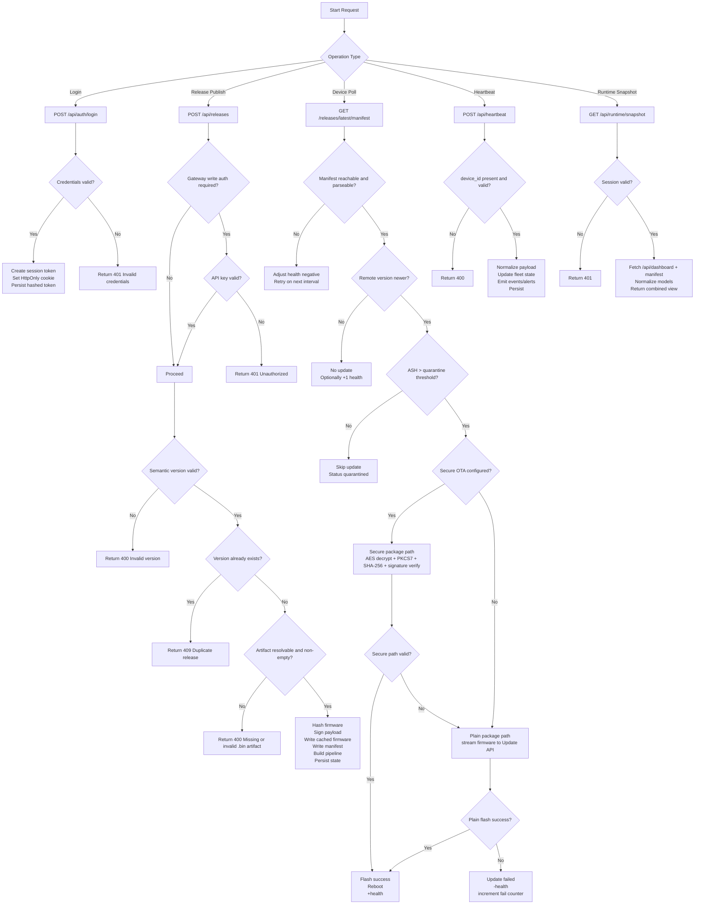
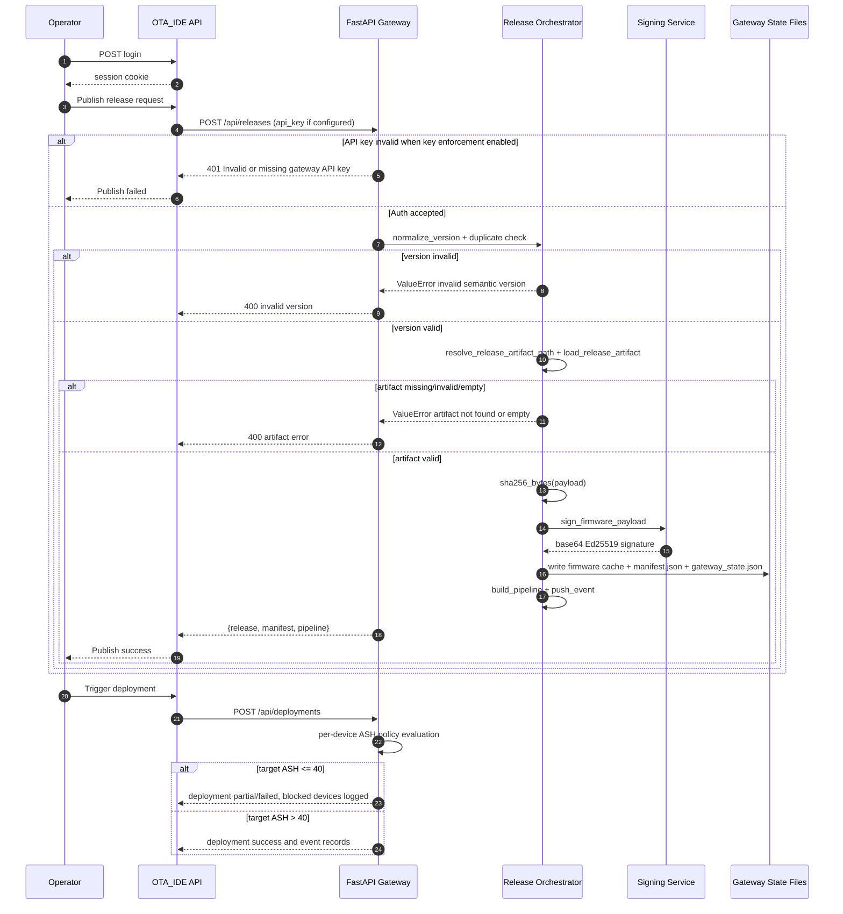

# Secure_OTA: Technical System Architecture, Workflow Logic, and Full Path Coverage

This document defines the complete technical architecture for the project, including:
- subsystem functions
- control-flow logic
- yes/no decision paths
- operation side effects
- data and state transitions

It is aligned to the implemented stack in:
- CODE/OTA_IDE (Next.js control plane)
- src/implementation/edge_gateway.py (FastAPI gateway)
- CODE/frimware_code/esp32_ota_main/esp32_ota_main.ino (firmware OTA engine)

## 1. Runtime Topology and Trust Boundaries

```mermaid
flowchart LR
  subgraph UserZone[User Zone]
    U[Operator / Developer]
    B[Browser Session]
  end

  subgraph ControlPlane[Control Plane: CODE/OTA_IDE]
    UI[Dashboard Pages\nDevices, Releases, Pipeline, Logs, Settings]
    API[Next.js API Routes\n/auth, /runtime, /serial, /webhooks]
    SEC[Security Layer\nwithSecureApi + authenticateRequest]
    LDB[(Local Data Store\nusers, sessions, API logs, upload jobs)]
    CLI[Serial Upload Worker\narduino-cli compile/upload]
  end

  subgraph GatewayPlane[Gateway Plane: FastAPI]
    GAPI[Gateway Endpoints\n/healthz\n/api/heartbeat\n/api/dashboard\n/api/releases\n/api/deployments\n/api/pipeline/run\n/api/trigger_sync]
    ORCH[Release and Deployment Orchestrator]
    SIGN[Cryptographic Signer\nEd25519 private key signing]
    GSTATE[(gateway_state.json)]
    GMAN[(manifest.json)]
    GFW[(firmware_vX.Y.Z.bin cache)]
    GKEY[(gateway_keys\nprivate/public key pair)]
  end

  subgraph DevicePlane[Device Plane]
    DFW[Firmware Runtime\ncheckBackendOTA\nperformHttpUpdate\nadjustHealth\nsendHeartbeat]
    NVS[(Preferences/NVS\nhealth, quarantine, fail counters)]
  end

  subgraph BuildPlane[Build and Artifact Plane]
    PIO[PlatformIO / Arduino Build]
    CI[GitHub Actions Build]
    ART[(release-assets / firmware_repo)]
  end

  U --> B --> UI --> API --> SEC --> LDB
  API --> CLI

  PIO --> ART
  CI --> ART
  ART --> API

  API -->|Write actions\nPOST /api/releases /api/deployments| GAPI
  GAPI --> ORCH --> SIGN --> GKEY
  ORCH --> GFW
  ORCH --> GMAN
  ORCH --> GSTATE

  DFW -->|GET /releases/latest/manifest| GAPI
  DFW -->|GET /releases/download/{filename}| GAPI
  DFW -->|POST /api/heartbeat| GAPI
  DFW <--> NVS

  API -->|GET /api/dashboard\nGET /releases/latest/manifest| GAPI
  GAPI -->|aggregated telemetry + release state| API
  API --> UI
```

### Trust boundaries
- Boundary A: Browser session to OTA_IDE API (cookie session and bearer-token fallback).
- Boundary B: OTA_IDE to gateway write APIs (x-api-key or query api_key).
- Boundary C: Gateway to firmware clients (manifest and binary distribution).
- Boundary D: Device local execution boundary (flash write, reboot, health policy in firmware).

## 2. Control-Flow Supergraph (Global)



## 3. Release and Deployment Control Flow (Write-Path Logic)



## 4. Firmware OTA Decision Engine (Device Control Flow)

```mermaid
flowchart TD
  F0[loop()] --> F1{Manual button held 3s?}
  F1 -->|Yes| F2[checkBackendOTA()]
  F1 -->|No| F3{Periodic check interval elapsed?}
  F3 -->|No| F7{Heartbeat interval elapsed?}
  F3 -->|Yes| F4{inQuarantine?}
  F4 -->|Yes| F5[Skip backend update check]
  F4 -->|No| F2

  F2 --> F20[fetchLatestRelease()]
  F20 --> F21{HTTP manifest fetch success?}
  F21 -->|No| F22[adjustHealth -1 network error]
  F21 -->|Yes| F23[parseVersion remote]
  F23 --> F24{remote == current?}
  F24 -->|Yes| F25[No update; adjustHealth +1 poll success]
  F24 -->|No| F26{remote < current?}
  F26 -->|Yes| F27[Anti-rollback block]
  F26 -->|No| F28[performHttpUpdate(downloadUrl)]

  F28 --> F29{isSecureOtaConfigured?}
  F29 -->|Yes| F30[performSecurePackageUpdate]
  F29 -->|No| F34[performPlainPackageUpdate]

  F30 --> F31{Secure validation pass?\nheader + decrypt + PKCS7 + signature}
  F31 -->|Yes| F32[Update.end true -> reboot]
  F31 -->|No| F34

  F34 --> F35{Plain update pass?}
  F35 -->|Yes| F32
  F35 -->|No| F36[failedAttempts24h++\nadjustHealth -25]

  F7 -->|Yes| F8[sendHeartbeat()]
  F8 --> F9[adjustHealth +1 poll success]
  F7 -->|No| F10[continue loop]

  F5 --> F7
  F22 --> F7
  F25 --> F7
  F27 --> F7
  F32 --> F33[ESP.restart]
  F36 --> F7
  F9 --> F10
```

## 5. Functional Coverage: Endpoint and Function Map

| Op ID | Layer | Entry Point | Core Functions | Preconditions | Success Operations | Failure Operations |
| --- | --- | --- | --- | --- | --- | --- |
| OP-01 | OTA_IDE | POST /api/auth/login | loginWithPassword | username and password provided | create session token, set HttpOnly cookie, return user profile | 401 invalid credentials |
| OP-02 | OTA_IDE | GET /api/auth/session | authenticateRequest | valid cookie or bearer token | return active session context | 401 unauthorized |
| OP-03 | OTA_IDE | withSecureApi wrapper | initializeLocalDatabase, ensureDefaultAdminUser | route invoked | auth check, route execution, API log insertion | standardized 500 response and error tracking |
| OP-04 | OTA_IDE | POST /api/serial/upload | startSerialUpload, runUploadJob | valid .ino path, board type, COM port | compile then upload via arduino-cli, persist logs and status | job status failed with error message |
| OP-05 | OTA_IDE | GET /api/serial/upload/{jobId} | getUploadJobSnapshot | existing job id | incremental job logs/progress | not found or stale state |
| OP-06 | OTA_IDE | GET /api/runtime/snapshot | fetchJson gateway dashboard and manifest | valid session | normalized devices/events/releases/pipeline payload | partial degraded response if one upstream call fails |
| OP-07 | OTA_IDE | POST /api/runtime/actions | fetchGatewayJson, updateRuntimeActionsState | valid session and supported action | executes action (manifest/report/simulator/tag/key etc.) and logs action | 400 or 404 unsupported/invalid action |
| OP-08 | OTA_IDE | POST /api/runtime/command | authenticateRequest, allowlist validation | commands enabled, allowlisted root, auth/service token | execute command in controlled shell context and return output | 400 blocked command, 401 unauthorized, 403 disabled/not allowlisted |
| OP-09 | Gateway | GET /healthz | gateway_snapshot | service active | health payload with counts and latest manifest version | N/A |
| OP-10 | Gateway | POST /api/releases | create_release_locked | optional auth key accepted, payload valid | write firmware cache, compute SHA-256, sign, create manifest and pipeline, persist state | 400 invalid artifact/version, 409 duplicate version, 401 invalid API key |
| OP-11 | Gateway | GET /api/releases | list releases from state | state initialized | return release inventory | N/A |
| OP-12 | Gateway | GET /api/releases/latest | latest release retrieval | release exists | return release + manifest pair | 404 no release available |
| OP-13 | Gateway | GET /releases/latest/manifest | manifest lookup | manifest in file or state | return manifest JSON | 404 no manifest available |
| OP-14 | Gateway | GET /releases/latest/public-key | get_signing_key | key available or generated | return Ed25519 public key metadata | runtime key-load error |
| OP-15 | Gateway | GET /releases/download/{filename} | safe_cache_path, FileResponse | filename valid and cached | stream firmware and increment downloadCount | 400 invalid filename, 404 not cached |
| OP-16 | Gateway | POST /api/heartbeat | receive_heartbeat | valid device_id | update device telemetry, push alerts/events, persist gateway_state | 400 invalid payload |
| OP-17 | Gateway | GET /api/dashboard | get_dashboard_data | state readable | return full runtime snapshot (devices/events/releases/pipeline/keys/deployments) | N/A |
| OP-18 | Gateway | POST /api/deployments | create_deployment | release exists and target devices resolved | ASH-aware deployment, success/partial/failed status, event creation | 404 release missing, 400 no target devices |
| OP-19 | Gateway | POST /api/pipeline/run | run_pipeline | release exists | rebuild pipeline simulation and persist | 404 release missing |
| OP-20 | Gateway | POST /api/trigger_sync | trigger_sync | write auth accepted | create sync alert/event and persist | 401 when API key required but invalid |
| OP-21 | Firmware | checkBackendOTA | fetchLatestRelease, parseVersion | WiFi connected | detect newer version and start OTA | network failure leads to health penalty |
| OP-22 | Firmware | performHttpUpdate | isSecureOtaConfigured | update URL available | secure-first update orchestration with fallback | propagate failure to caller |
| OP-23 | Firmware | performSecurePackageUpdate | AES/MD/PK contexts, Update API | secure keys configured, package format valid | decrypt payload, verify signature, write flash, finalize update | abort update, return false |
| OP-24 | Firmware | performPlainPackageUpdate | Update.begin, writeStream | HTTP fetch success | stream plain binary and finalize flash | abort on size mismatch/stream/finalize errors |
| OP-25 | Firmware | adjustHealth | constrain and threshold logic | health delta emitted | persist updated health, enter/exit quarantine, optionally reinit OTA | no-op path if unchanged |
| OP-26 | Firmware | sendHeartbeat | JSON payload builder and HTTP POST | WiFi connected | report ASH, version, status, RSSI, memory, logs | silent skip if unreachable |

## 6. Yes/No Decision Matrix and Full Path Coverage

| Decision ID | Decision Point | YES Branch Operations | NO Branch Operations | Covered Outcomes |
| --- | --- | --- | --- | --- |
| D-01 | Credentials valid at login | create session token, set cookie, return 200 | return 401 invalid credentials | auth success, auth rejection |
| D-02 | Session valid for protected APIs | execute requested route logic | return 401 unauthorized | protected access, blocked access |
| D-03 | Runtime commands enabled | proceed to command validation | return 403 disabled | command execution, hard-disable |
| D-04 | Command root allowlisted and safe | execute shell command | return 400/403 blocked command | safe op, injection/destructive prevention |
| D-05 | Gateway API key enforcement enabled | require x-api-key/query api_key/bearer equivalence | allow write endpoint without key check | secured write mode, open dev mode |
| D-06 | Provided gateway API key valid | continue write operation | return 401 invalid or missing key | authorized write, denied write |
| D-07 | Release version syntactically valid | continue release pipeline | return 400 version format error | semver acceptance, semver rejection |
| D-08 | Release version already exists | return 409 duplicate release | continue with new release | duplication guard, fresh publish |
| D-09 | Artifact resolvable and non-empty | hash/sign/store artifact | return 400 artifact error | successful packaging, artifact failure |
| D-10 | Manifest available | return manifest payload | return 404 no manifest | distribution ready, not-ready state |
| D-11 | Device currently quarantined | skip OTA checks; keep runtime safe | continue update polling path | policy lockout, policy pass |
| D-12 | Manifest fetch from gateway succeeds | parse payload and compare versions | network error handling and health penalty | connected poll, disconnected poll |
| D-13 | Remote version newer than current | start update path | no update path; optionally reward poll success | upgrade branch, steady-state branch |
| D-14 | Remote version lower than current | anti-rollback block | continue normal path | downgrade prevention, normal evaluation |
| D-15 | Secure OTA configuration present | run secure decrypt/verify flow | go directly to plain OTA flow | secure mode, plain mode |
| D-16 | Secure package validation passes | finalize update and reboot | fall back to plain OTA flow | secure success, secure fallback |
| D-17 | Plain OTA update passes | finalize update and reboot | register failure, decrement health | plain success, update failure |
| D-18 | Heartbeat payload has valid device_id | update fleet state and events | return 400 invalid payload | telemetry ingest success, payload reject |
| D-19 | Deployment release exists | evaluate device targets | return 404 no releases | deployment progression, precondition failure |
| D-20 | Deployment target device exists | apply deployment decision to device | count failure and log missing target | target success/fail coverage |
| D-21 | Device ASH above threshold for deployment | update device firmware metadata and success log | block deployment for device, security event | policy-allow, policy-block |
| D-22 | Snapshot can reach dashboard and manifest | return ok true full aggregation | return degraded snapshot with connection error metadata | full observability, partial observability |
| D-23 | Session expired at auth check | revoke stale session and deny access | keep active session | expiry handling, active session path |
| D-24 | Secure OTA final block padding valid | continue hash+flash write | abort secure flow | cryptographic integrity pass/fail |

## 7. Operations and Side Effects by Data Store

| Store / Artifact | Writers | Read Paths | Side Effects |
| --- | --- | --- | --- |
| OTA_IDE local users/sessions store | ensureDefaultAdminUser, loginWithPassword, revokeRequestToken | authenticateRequest, auth session route | session lifecycle, bootstrap admin initialization |
| OTA_IDE upload job stores | startSerialUpload, runUploadJob, appendUploadLog | upload job status route | serial compile/upload audit trail and progress history |
| gateway_firmware_cache/gateway_state.json | receive_heartbeat, create_release_locked, create_deployment, run_pipeline, trigger_sync | dashboard, healthz, events/release/deploy endpoints | source of runtime truth for fleet and release telemetry |
| gateway_firmware_cache/manifest.json | create_release_locked, manifest refresh logic | /releases/latest/manifest, OTA_IDE snapshot, device poll | latest distribution descriptor |
| gateway_firmware_cache/firmware_vX.Y.Z.bin | create_release_locked | /releases/download/{filename}, device update engine | versioned binary distribution and download counts |
| gateway_keys/ed25519_private_key.pem | load_or_create_signing_key | sign_firmware_payload | cryptographic signing material |
| gateway_keys/ed25519_public_key.pem | load_or_create_signing_key | /releases/latest/public-key, simulator/device verification | public trust anchor distribution |
| firmware Preferences NVS | saveHealth | loadHealth, adjustHealth | persistent ASH/quarantine continuity across reboot |

## 8. Control Planes and Protocol Behavior

### 8.1 Control Plane
- Human-initiated management actions: login, release creation, deployment actions, serial flash jobs, runtime actions.
- APIs are mediated by session authentication and standardized secure wrappers.
- Gateway write APIs are optionally API-key enforced for production posture.

### 8.2 Distribution Plane
- Gateway manifests and binaries are distributed over HTTP endpoints.
- Device update engine enforces anti-rollback and secure verification before commit.
- Secure path is attempted first when keys are configured, with plain fallback for compatibility.

### 8.3 Telemetry Plane
- Heartbeat ingest continuously updates device runtime models.
- Gateway emits events and alerts for anomalous states.
- OTA_IDE snapshot endpoint performs model normalization and serves UI-ready aggregated state.

## 9. Security and Policy Control Logic

### 9.1 Authentication and session management
- Password hashing uses scrypt-derived salted hashes.
- Session tokens are random high-entropy values; gateway/IDE persist token hash only.
- HttpOnly cookie prevents direct script access to session token in browser context.

### 9.2 Gateway integrity controls
- Ed25519 signature generation is performed per released payload.
- Public key endpoint supports verifier distribution.
- File download path validates filename safety before serving cache files.

### 9.3 Firmware safety controls
- Anti-rollback policy:
  - version_n = major * 10000 + minor * 100 + patch
  - reject update when remote version_n < current version_n
- ASH policy:
  - health_t+1 = clamp(health_t + delta, 0, 100)
  - quarantine when health < 40
  - update path blocked while quarantined
- Secure package path validates:
  - package header length and structure
  - AES-256-CBC decrypt integrity
  - PKCS7 padding correctness
  - SHA-256 digest and signature verification

## 10. Failure Handling and Recovery Paths

| Failure Class | Detection Point | Immediate Action | Recovery Path |
| --- | --- | --- | --- |
| Invalid login | /api/auth/login | reject 401 | retry with valid credentials |
| Unauthorized API access | withSecureApi/authenticateRequest | reject 401 | relogin and refresh session |
| Missing gateway key | require_write_auth | reject 401 | configure matching OTA_GATEWAY_API_KEY and EDGE_GATEWAY_API_KEY |
| Invalid release version | normalize_version | reject 400 | provide numeric semantic version |
| Missing or bad artifact | resolve_release_artifact_path/load_release_artifact | reject 400 | provide valid .bin path |
| Duplicate release | create_release_locked | reject 409 | publish new semantic version |
| Manifest unavailable | get_manifest | 404 | publish release to create manifest |
| Network failure during poll | fetchLatestRelease | health decrement | retry on next interval |
| Secure validation failure | performSecurePackageUpdate | secure abort and fallback to plain | plain update path attempt |
| Plain OTA failure | performPlainPackageUpdate | abort update, health decrement | retry later/manual remediation |
| Quarantine block | adjustHealth / deployment policy | block update | recover health to lift quarantine |
| Heartbeat payload invalid | receive_heartbeat | reject 400 | correct device payload schema |

## 11. Canonical End-to-End Functional Chain

1. Operator authenticates with OTA_IDE and receives an HttpOnly session cookie.
2. Operator initiates release publication with version and artifact metadata.
3. Gateway validates auth policy, semantic version, and artifact availability.
4. Gateway computes checksum, signs payload, writes manifest, caches firmware, and updates pipeline state.
5. Devices poll manifest, evaluate anti-rollback, and enforce ASH policy gate.
6. Device executes secure OTA path when configured; otherwise plain OTA path.
7. Device flashes firmware on success and reboots; on failure updates health/failure counters.
8. Device posts heartbeat telemetry (version, ASH, status, metrics, logs).
9. Gateway updates fleet state, events, alerts, and deployment records.
10. OTA_IDE runtime snapshot aggregates gateway state into UI-ready operational views.

## 12. Coverage Completion Checklist

- Authentication success and failure paths covered.
- API authorization success and failure paths covered.
- Release validation (version, duplicate, artifact) paths covered.
- Manifest presence/absence paths covered.
- Device update branches covered:
  - up-to-date path
  - anti-rollback block path
  - quarantine block path
  - secure success path
  - secure fail to plain fallback path
  - plain fail path
- Heartbeat ingestion valid/invalid payload paths covered.
- Deployment policy pass/block paths covered.
- Observability full/degraded snapshot paths covered.

This file is intended to be the authoritative technical workflow reference for implementation, testing, review, and documentation deliverables.
